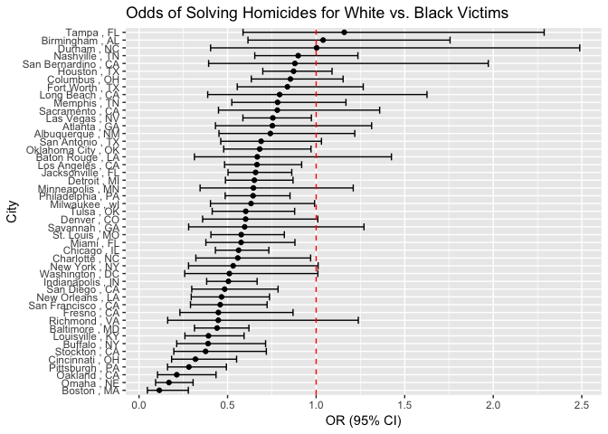

p8105\_hw6\_er2867
================
Elliot
November 25, 2018

Question 1 - Cleaned the data, created `city_state` variable, and binary `solved` variable. Omitted cities that don't report race, plus data entry mistake of Tulsa, AL. Modified `victim_race` into categories of `white` and `non-white`, with `white` as reference. Made `victim_age` a numeric variable.

``` r
homicides = read_csv("hw6_data/homicide-data.csv") %>% 
  janitor::clean_names()

homicides_citystate = 
  homicides %>% 
  mutate(city_state = paste(city, ",", state)) %>% 
  group_by(city_state) %>% 
  filter(!(city_state %in% c("Dallas , TX", "Phoenix , AZ", "Kansas City , MO", "Tulsa , AL"))) %>% 
  mutate(solved = if_else(disposition == "Closed by arrest", "solved", "unresolved")) %>% 
  mutate(solved = fct_relevel(solved, "unresolved")) %>% 
  mutate(victim_age = as.numeric(victim_age)) %>% 
  mutate(victim_race = tolower(victim_race)) %>% 
  mutate(binary_race = fct_collapse(victim_race, "non-white" = c("asian","black", "hispanic", "other","unknown"))) %>% 
  mutate(binary_race = fct_relevel(binary_race, "white"))
```

For Baltimore, MD, fit logisitc regression w/ `solved` as outcome and `victim_age`, `binary_race`, and `victim_sex` as covariates. Obtained OR and CI intervals.

``` r
baltimore_homicide = 
  homicides_citystate %>% 
  filter(city_state == "Baltimore , MD")

logistic_baltimore = glm(solved ~ victim_age + victim_sex + binary_race, data = baltimore_homicide, family =   binomial())

logistic_baltimore %>% 
  broom::tidy() %>% 
  janitor::clean_names() %>% 
  mutate(OR = exp(estimate)) %>% 
  mutate(upper_ci = exp(estimate + (1.96 * std_error))) %>% 
  mutate(lower_ci = exp(estimate - (1.96 * std_error))) %>% 
  filter(term == "binary_racenon-white") %>% 
  select(OR, lower_ci, upper_ci, p_value) %>% 
  knitr::kable(digits = c(3, 3, 3, 10))
```

|     OR|  lower\_ci|  upper\_ci|    p\_value|
|------:|----------:|----------:|-----------:|
|  0.441|      0.313|       0.62|  2.6826e-06|

Ran logistic regression for each city in dataset, extracted adjusted OR and CI's.

``` r
all_cities = 
  homicides_citystate %>% 
  group_by(city_state) %>% 
  nest() %>% 
  mutate(models = map(.x = data, ~ glm(solved ~ binary_race + victim_age + victim_sex, 
  family = binomial, data = .x))) %>% 
  mutate(models = map(models, broom::tidy)) %>% 
  select(-data) %>% 
  unnest() %>% 
  janitor::clean_names() %>% 
  mutate(upper_ci = exp(estimate + (1.96 * std_error))) %>% 
  mutate(lower_ci = exp(estimate - (1.96 * std_error))) %>% 
  filter(term == "binary_racenon-white") %>% 
  mutate(OR = exp(estimate)) %>% 
  select(city_state, OR, lower_ci, upper_ci)
```

Created a pot showing OR's and CI's by city, organizing city by OR.

``` r
ordered_cities = 
  all_cities %>% 
  mutate(city_state = reorder(city_state, OR))

ggplot(ordered_cities, aes(x = city_state, y = OR )) + 
  geom_point() + 
  geom_errorbar(aes(ymin = lower_ci, ymax = upper_ci)) + 
  coord_flip() +
  geom_hline(aes(yintercept = 1.00), linetype = "dashed", color = "red") + 
  labs(
    y = "OR (95% CI)",
    x = "City",
    title = "Odds of Solving Homicides for White vs. Black Victims"
  )
```


