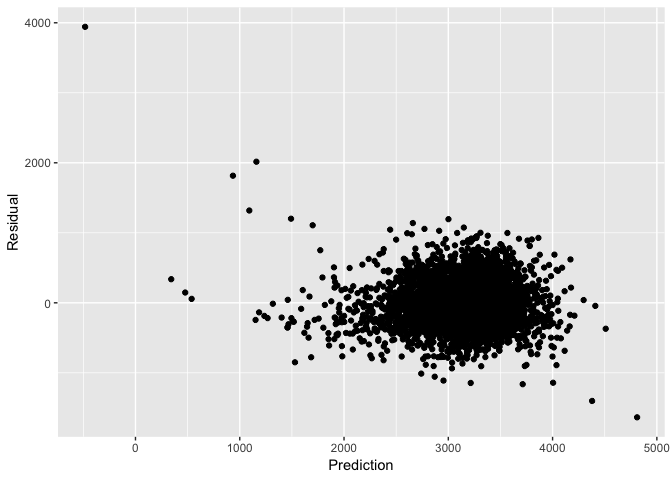
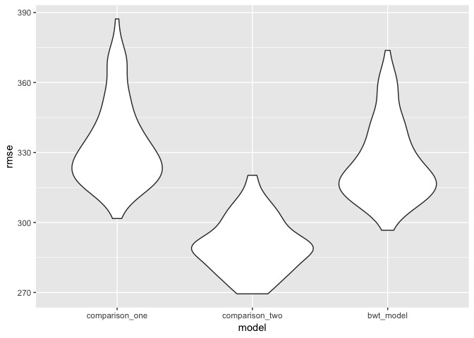

p8105\_hw6\_er2867
================
Elliot
November 25, 2018

Question 1 - Cleaned the data, created `city_state` variable, and binary `solved` variable. Omitted cities that don't report race, plus data entry mistake of Tulsa, AL. Modified `victim_race` into categories of `white` and `non-white`, with `white` as reference. Made `victim_age` a numeric variable.

``` r
homicides = read_csv("hw6_data/homicide-data.csv") %>% 
  janitor::clean_names()

homicides_citystate = 
  homicides %>% 
  mutate(city_state = paste(city, ",", state)) %>% 
  group_by(city_state) %>% 
  filter(!(city_state %in% c("Dallas , TX", "Phoenix , AZ", "Kansas City , MO", "Tulsa , AL"))) %>% 
  mutate(solved = if_else(disposition == "Closed by arrest", "solved", "unresolved")) %>% 
  mutate(solved = fct_relevel(solved, "unresolved")) %>% 
  mutate(victim_age = as.numeric(victim_age)) %>% 
  mutate(victim_race = tolower(victim_race)) %>% 
  mutate(binary_race = fct_collapse(victim_race, "non-white" = c("asian","black", "hispanic", "other","unknown"))) %>% 
  mutate(binary_race = fct_relevel(binary_race, "white"))
```

For Baltimore, MD, fit logisitc regression w/ `solved` as outcome and `victim_age`, `binary_race`, and `victim_sex` as covariates. Obtained OR and CI intervals.

``` r
baltimore_homicide = 
  homicides_citystate %>% 
  filter(city_state == "Baltimore , MD")

logistic_baltimore = glm(solved ~ victim_age + victim_sex + binary_race, data = baltimore_homicide, family =   binomial())

logistic_baltimore %>% 
  broom::tidy() %>% 
  janitor::clean_names() %>% 
  mutate(OR = exp(estimate)) %>% 
  mutate(upper_ci = exp(estimate + (1.96 * std_error))) %>% 
  mutate(lower_ci = exp(estimate - (1.96 * std_error))) %>% 
  filter(term == "binary_racenon-white") %>% 
  select(OR, lower_ci, upper_ci, p_value) %>% 
  knitr::kable(digits = c(3, 3, 3, 10))
```

|     OR|  lower\_ci|  upper\_ci|    p\_value|
|------:|----------:|----------:|-----------:|
|  0.441|      0.313|       0.62|  2.6826e-06|

Ran logistic regression for each city in dataset, extracted adjusted OR and CI's.

``` r
all_cities = 
  homicides_citystate %>% 
  group_by(city_state) %>% 
  nest() %>% 
  mutate(models = map(.x = data, ~ glm(solved ~ binary_race + victim_age + victim_sex, 
  family = binomial, data = .x))) %>% 
  mutate(models = map(models, broom::tidy)) %>% 
  select(-data) %>% 
  unnest() %>% 
  janitor::clean_names() %>% 
  mutate(OR = exp(estimate)) %>% 
  mutate(upper_ci = exp(estimate + (1.96 * std_error))) %>% 
  mutate(lower_ci = exp(estimate - (1.96 * std_error))) %>% 
  filter(term == "binary_racenon-white") %>% 
  select(city_state, OR, lower_ci, upper_ci)
```

Created a pot showing OR's and CI's by city, organizing city by OR.

``` r
ordered_cities = 
  all_cities %>% 
  mutate(city_state = reorder(city_state, OR))

ggplot(ordered_cities, aes(x = city_state, y = OR )) + 
  geom_point() + 
  geom_errorbar(aes(ymin = lower_ci, ymax = upper_ci)) + 
  coord_flip() +
  geom_hline(aes(yintercept = 1.00), linetype = "dashed", color = "red") + 
  labs(
    y = "OR (95% CI)",
    x = "City",
    title = "Odds of Solving Homicides for White vs. Black Victims"
  )
```


Problem 2 - load and clean data, check for missing data (none found). It is hypothesized that gestational age in weeks (`gaweeks`) will have an effecet on the outcome of birthweight (`bwt`), and I will adjust the factors hypothesized to have for baby's sex, baby's length, mother's delivery weight(chosen over other mother's weight variables), malformations that could affeect weight, mother's age, number of prior small gestational age babies, and cigarettes per day.

``` r
bwt = read_csv("hw6_data/birthweight.csv") %>% 
  janitor::clean_names() %>% 
  mutate(blength = as.numeric(blength)) %>% 
  mutate(delwt = as.numeric(delwt)) %>% 
  mutate(momage = as.numeric(momage)) %>% 
  mutate(pnumsga = as.numeric(pnumsga)) %>% 
  mutate(smoken = as.numeric(smoken))
```

    ## Parsed with column specification:
    ## cols(
    ##   .default = col_integer(),
    ##   gaweeks = col_double(),
    ##   ppbmi = col_double(),
    ##   smoken = col_double()
    ## )

    ## See spec(...) for full column specifications.

``` r
  filter_all(bwt, any_vars(is.na(.)))
```

    ## # A tibble: 0 x 20
    ## # ... with 20 variables: babysex <int>, bhead <int>, blength <dbl>,
    ## #   bwt <int>, delwt <dbl>, fincome <int>, frace <int>, gaweeks <dbl>,
    ## #   malform <int>, menarche <int>, mheight <int>, momage <dbl>,
    ## #   mrace <int>, parity <int>, pnumlbw <int>, pnumsga <dbl>, ppbmi <dbl>,
    ## #   ppwt <int>, smoken <dbl>, wtgain <int>

My model, the association between gestational age (`gaweeks`) and birthweight(`bwt`), adjusting for baby's sex and length, mother's delivery weight, malformations affecting birth weight, mother's age, previous low-weight children, and cigarettes per day. Because the outcome (bwt) is continuous, we will use a linear regression model

``` r
bwt_model = lm(bwt ~ gaweeks + babysex + blength + delwt  + malform + momage + pnumsga + smoken, data = bwt)
bwt_model %>% 
  broom::tidy() 
```

    ## # A tibble: 8 x 5
    ##   term        estimate std.error statistic  p.value
    ##   <chr>          <dbl>     <dbl>     <dbl>    <dbl>
    ## 1 (Intercept) -4494.     100.      -44.7   0.      
    ## 2 gaweeks        25.9      1.70     15.3   1.56e-51
    ## 3 babysex       -19.1      9.98     -1.91  5.60e- 2
    ## 4 blength       122.       2.01     60.7   0.      
    ## 5 delwt           2.69     0.230    11.7   2.81e-31
    ## 6 malform        59.7     84.4       0.708 4.79e- 1
    ## 7 momage          7.90     1.29      6.12  1.03e- 9
    ## 8 smoken         -3.44     0.674    -5.10  3.57e- 7

Our model showed there is a significant association between gestational week and birthweight when adjusting for the baby's sex and length, mother's delivery weight, malformations affecting birth weight, mother's age, previous low-weight children, and cigarettes for day. (beta = 25.94, p&lt;0.00001)

next we plotted residuals against predicted values

``` r
bwt %>% 
  modelr::add_predictions(bwt_model) %>% 
  modelr::add_residuals(bwt_model) %>% 
  ggplot(aes(x = pred, y = resid)) + geom_point() +
  labs(x = "Prediction", 
       y = "Residual")
```

    ## Warning in predict.lm(model, data): prediction from a rank-deficient fit
    ## may be misleading

    ## Warning in predict.lm(model, data): prediction from a rank-deficient fit
    ## may be misleading

 Next, we compared our model to two others: one using birth length and gestational age as predictors, and one using head circumfrance, length, sex, and all interactions

``` r
comparison_one = lm(bwt ~ blength + gaweeks, data = bwt)
comparison_two = lm(bwt ~ bhead * blength * babysex, data = bwt)
```

Cross validation

``` r
set.seed(1)
cross_validation =
  crossv_mc(bwt, 100) %>%  
  mutate(train = map(train, as_tibble)) %>% 
  mutate(test = map(test, as_tibble)) %>% 
  mutate(comparison_one = map(train, ~ lm(bwt ~ blength + gaweeks, data = .x))) %>% 
  mutate(comparison_two = map(train, ~ lm(bwt ~ bhead * blength * babysex, data = .x))) %>% 
  mutate(bwt_model = map(train, ~ lm(bwt ~ gaweeks + babysex + blength + delwt  + malform + momage + pnumsga +          smoken, data = .x))) %>% 
  mutate(rmse_comparison_one = map2_dbl(comparison_one, test, ~ rmse(model = .x, data = .y))) %>% 
  mutate(rmse_comparison_two = map2_dbl(comparison_two, test, ~ rmse(model = .x, data = .y))) %>% 
  mutate(rmse_bwt_model = map2_dbl(bwt_model, test, ~ rmse(model = .x, data = .y)))

cross_validation %>% 
  select(starts_with("rmse")) %>% 
  gather(key = model, value = rmse) %>% 
   mutate(model = str_replace(model, "rmse_", ""),
         model = fct_inorder(model)) %>% 
  ggplot(aes(x = model, y = rmse)) + geom_violin()
```



``` r
cross_validation %>% 
  select(starts_with("rmse")) %>% 
  gather(key = model, value = rmse) %>% 
  group_by(model) %>% 
  summarize(mean_rmse = mean(rmse)) %>% 
  arrange(mean_rmse) %>% 
  knitr::kable(digits = 3)
```

| model                 |  mean\_rmse|
|:----------------------|-----------:|
| rmse\_comparison\_two |     290.156|
| rmse\_bwt\_model      |     325.862|
| rmse\_comparison\_one |     333.455|
| \`\`\`                |            |

The RMSE results make it clear that comparison model two, with the interaction terms, has the lowest RMSE and thus is the best model and has the best fit.
